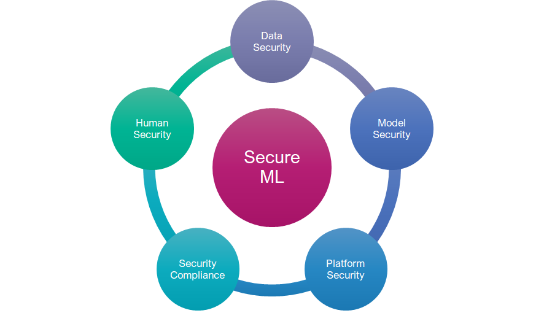

### Table of Contents

- [Security Policy for Machine Learning Systems](security-policy/ml-secpol.md)
- [Machine Learning Privacy-Preserving Techniques](privacy/ml-privacy-techniques.md)
- [Tools for Securing Machine Learning](tools/ml-security-tools.md)
- [Security Threats to Machine Learning](ml-threats/ml-threats.md)
- [ML Security Regulations and Standards](ml-security-industry-references.md)

## Security Policy for Machine Learning Systems

A ThalesGroup policy framework to secure machine learning datasets, models, underlying platform, compliance with internal and external regulations, and to humans involved.

****

Available at [ML Security Policy](security-policy/ml-secpol.md) with [ML Security Requirements](security-policy/ml-secpol-detailed.md) and [ML Security Guidelines](security-policy/guidelines/ml-secpol-guidelines.md)

## Machine Learning Privacy-Preserving Techniques
Learn about cutting-edge privacy-preserving techniques for machine learning including Differential Privacy, Federated Learning, Homomorphic Encryption, Secure Multi-Party Computation (SMPC), and Privacy-Preserving Data Synthesis in this comprehensive GitHub repository. Explore how these methods safeguard sensitive data while enabling collaborative analysis and model training.

Available at [ML privacy-preserving techniques](privacy/ml-privacy-techniques.md)

## Tools for Securing Machine Learning

Discover essential security tools for source code vulnerability detection, comprehensive attack and defense tools, ML supply chain security solutions, and privacy and compliance tools. Additionally, explore techniques for securing Jupyter notebooks, ensuring robust protection for your data, code, and models. Embrace a holistic approach to cybersecurity and data privacy in your development and analysis workflows.

Available at [ML security tools](tools/ml-security-tools.md)

## Security Threats to Machine Learning

Available at [ML Security Threats](ml-threats/ml-threats.md)

## Presentation on ML Security Risks, Policy, Tools, Privacy techniques and more

- **Video Link**: [Machine Learning Security Risks, Policy, Tools, and Privacy Techniques - OWASP LASCON 2024](https://youtu.be/vcRsGlrsFjs)
- **Conference**: OWASP LASCON 2024

## License

This project is licensed under the Creative Commons Attribution-NoDerivs 4.0 International (CC BY-ND 4.0) License. 
You can view the full license text [here](https://creativecommons.org/licenses/by-nd/4.0/legalcode).

## Project Contacts

For further information or to contribute to this project, you can reach out to the following contacts:

- **Project Leader and Key contributor:** Viswanath S Chirravuri  
  [LinkedIn](https://www.linkedin.com/in/chviswanath/)

- **Project Sponsors:**
  - Gilles Durbec  
    [LinkedIn](https://fr.linkedin.com/in/gilles-durbec-1435412)
  - Stephane Soustre  
    [LinkedIn](https://www.linkedin.com/in/stephane-soustre-09a10b2/)
