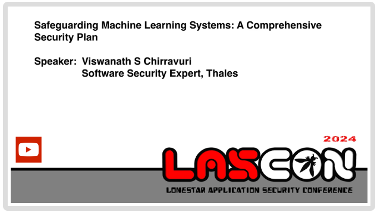

This repository provides a wealth of information on securing machine learning projects, including, but not limited to, the following items.

### Table of Contents

- [Security Policy for Machine Learning Systems](security-policy/ml-secpol.md)
- [Machine Learning Privacy-Preserving Techniques](privacy/ml-privacy-techniques.md)
- [Tools for Securing Machine Learning](tools/ml-security-tools.md)
- [Security Threats to Machine Learning](ml-threats/ml-threats.md)
- [ML Security Regulations and Standards](ml-security-industry-references.md)
- [Agentic AI Threat Comparison](agentic-ai/CSA_agenticAI_vs_OWASP_agenticAI_threats.md)
- [Agentic AI Lifecycle](agentic-ai/agentic-ai-lifecycle.md)

## Security Policy for Machine Learning Systems

A ThalesGroup policy framework to secure machine learning datasets, models, underlying platform, compliance with internal and external regulations, and to humans involved.

****

The purpose of this security policy (SecPol) is to provide a framework for ensuring the security and privacy of machine learning (ML) systems within the organization. This policy outlines activities, responsibilities, and guidelines to protect ML models, data, and infrastructure from unauthorized access, malicious attacks, and privacy breaches.

Available at [ML Security Policy](security-policy/ml-secpol.md) with [ML Security Requirements](security-policy/ml-secpol-detailed.md) and [ML Security Guidelines](security-policy/guidelines/ml-secpol-guidelines.md)

## Machine Learning Privacy-Preserving Techniques
Learn about cutting-edge privacy-preserving techniques for machine learning including Differential Privacy, Federated Learning, Homomorphic Encryption, Secure Multi-Party Computation (SMPC), and Privacy-Preserving Data Synthesis in this comprehensive GitHub repository. Explore how these methods safeguard sensitive data while enabling collaborative analysis and model training.

Available at [ML privacy-preserving techniques](privacy/ml-privacy-techniques.md)

## Tools for Securing Machine Learning

Discover a comprehensive collection of **40+ open-source security tools** specifically curated for securing machine learning systems across the entire ML lifecycle. This curated list covers critical security domains including:

- **Threat Modeling & Code Security**: AI system threat modeling, source code quality analysis, and third-party library vulnerability scanning
- **Adversarial Security**: Attack and defense tools, backdoor detection, vulnerability benchmarking, and model robustness testing
- **LLM Security**: Specialized vulnerability scanners and robustness assessment tools for Large Language Models
- **Privacy & Compliance**: Differential privacy libraries, privacy risk quantification, and compliance toolkits
- **Bias & Fairness**: Detection and mitigation tools for ensuring fairness in ML models
- **Model Explainability**: Interpretability frameworks for understanding model predictions and decisions
- **Data Quality & Validation**: Tools for data validation, label error detection, and quality profiling
- **Monitoring & Drift Detection**: Continuous model validation, data drift detection, and post-deployment monitoring
- **Data Version Control**: Version control systems for ML datasets and experiment tracking

Each tool is carefully categorized and includes direct links to repositories, making it easy to integrate security best practices into your ML workflow. Whether you're securing Jupyter notebooks, scanning models for unsafe code, or implementing privacy-preserving techniques, this comprehensive toolkit provides essential resources for robust ML security.

Available at [ML security tools](tools/ml-security-tools.md)

## Security Threats to Machine Learning

Available at [ML Security Threats](ml-threats/ml-threats.md)

## Presentation on ML Security Risks, Policy, Tools, Privacy techniques and more

- **Conference**: OWASP LASCON 2024
- **Agenda**: ML lifecycle/workflow, AI for Cyber vs Cyber for AI, Cyber Attacks, Risks, Threats, Thales Security Framework, Recommendations and more.

You can access the presentation deck (PDF) at 
[View Documentation (PDF)](presentations/ML_SecPlan.pdf) and other interesting [documents](documents/documents.md) for your reading.

## License

This project is licensed under the Creative Commons Attribution-NoDerivs 4.0 International (CC BY-ND 4.0) License. 
You can view the full license text [here](https://creativecommons.org/licenses/by-nd/4.0/legalcode).

## Project Contacts

For further information or to contribute to this project, you can reach out to the following contacts:

- **Project Leader and Key contributor:** Viswanath S Chirravuri  
  [LinkedIn](https://www.linkedin.com/in/vchirrav/)