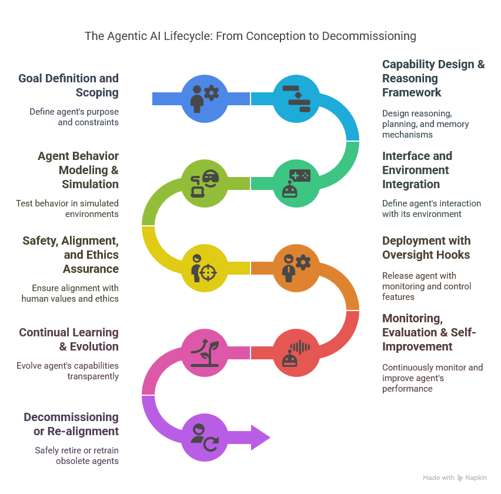

# 🧠 The Agentic AI Lifecycle: From Conception to Decommissioning

This document outlines the standardized lifecycle of agentic AI systems—intelligent agents capable of autonomous planning, reasoning, and acting within dynamic environments.

## 🔒 Why Lifecycle Governance is Critical for Secure Agentic AI

Agentic AI systems are **autonomous**, **goal-driven**, and **interactive**—which means they can act in unpredictable or emergent ways over time. A structured lifecycle approach:

- Ensures **security and safety checkpoints** exist before and after deployment
- Enables **accountability** by tracing goals, actions, and decisions throughout the agent's lifetime
- Helps detect **misalignment**, **reward hacking**, or **unintended behaviors** before real-world impact
- Provides a foundation for **regulatory compliance**, **risk mitigation**, and **human oversight**

Without a disciplined lifecycle, even well-intentioned agents can evolve into **opaque, unsafe, or ungovernable systems**.

---

> 📌 This lifecycle supports the development of transparent, safe, and autonomous agentic systems and is designed to adapt across single-agent and multi-agent implementations.

---

🖼️ **Diagram Source**:  
  
*Made with [Napkin](https://napkin.io)*

---

## 1. 🎯 Goal Definition and Scoping
Define the agent’s **purpose**, **goals**, and **constraints**.

- Clarify success metrics
- Identify task boundaries
- Define ethical and operational limitations

---

## 2. 🧠 Capability Design & Reasoning Framework
Design the agent’s **core reasoning and memory mechanisms**.

- Planning and task decomposition
- Episodic and semantic memory structures
- Self-reflection and decision heuristics

---

## 3. 🌐 Interface and Environment Integration
Specify how the agent **perceives inputs** and **executes actions**.

- API and tool access
- Sensory abstraction or simulation interface
- Environment-bound behavior rules

---

## 4. 🎮 Agent Behavior Modeling & Simulation
Test the agent in **sandboxed or simulated environments**.

- Evaluate behavioral patterns
- Assess success/failure rates
- Uncover emergent risks

---

## 5. 🔐 Safety, Alignment, and Ethics Assurance
Ensure the agent is **aligned with human values and safety constraints**.

- Bias and fairness audits
- Goal alignment verification
- Deception or manipulation prevention

---

## 6. 🚦 Deployment with Oversight Hooks
Deploy the agent with **runtime monitoring and control mechanisms**.

- Human-in-the-loop options
- Guardrails and rate-limiting
- Logging, rollback, and access control

---

## 7. 📈 Monitoring, Evaluation & Self-Improvement
Continuously evaluate the agent’s **real-world performance**.

- Track task outcomes
- Detect drift or misalignment
- Enable reflective learning and updates

---

## 8. 🔁 Continual Learning & Evolution
Improve the agent’s capabilities over time in a **transparent and controlled manner**.

- Integrate feedback loops
- Manage versioning
- Support task specialization

---

## 9. 🧹 Decommissioning or Re-alignment
**Safely retire or retrain** agents that are obsolete or misaligned.

- Memory cleanup or transfer
- Audit behavior logs
- Remove system access

---