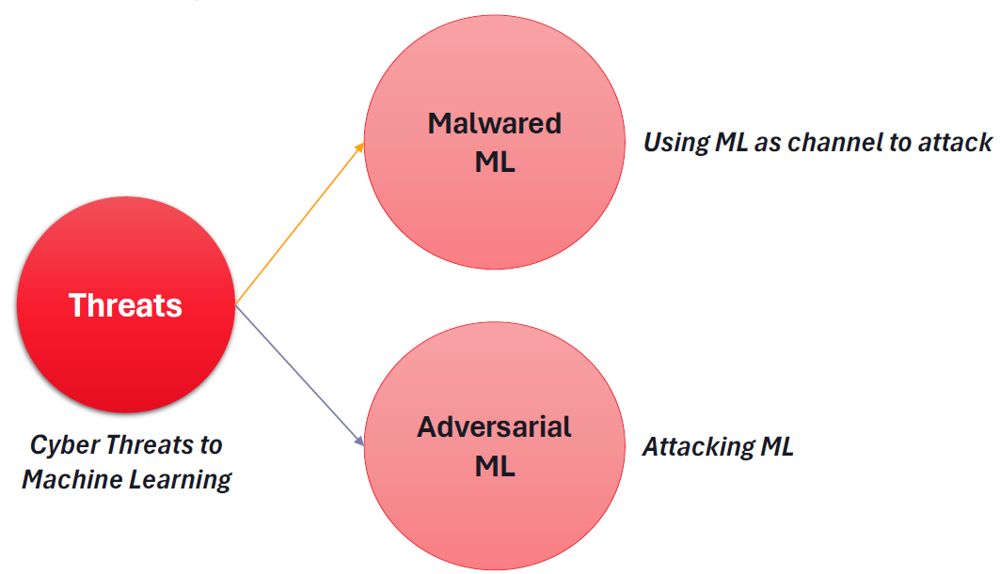

# Cyber Threats to Machine Learning

Machine learning systems are susceptible to various cyber threats, compromising their integrity and functionality. Understanding these threats is crucial for developing robust defense mechanisms. Here are two significant cyber threats to machine learning.

## 1. Malwared ML

Malwared ML involves exploiting machine learning systems as a channel to launch attacks. This threat encompasses various malicious activities, including:

- **Infiltrating Datasets**: Injecting malware such as viruses, trojans, worms, spyware, etc., into machine learning datasets.
- **Compromising Pre-trained Models**: Embedding malicious code or payloads into pre-trained models, potentially leading to harmful outcomes.
- **Manipulating Outputs**: Altering the output of machine learning models by injecting malicious data, thereby influencing decision-making processes.

## 2. Adversarial ML

Adversarial ML involves targeted attacks on machine learning models, aiming to deceive or manipulate their behavior. This threat encompasses various attack vectors, including:

- **Evasion Attacks**: Crafting input data to mislead the model's predictions, leading to incorrect outputs.
- **Inference Attacks**: Exploiting vulnerabilities in the model's inference process to extract sensitive information or infer hidden patterns.
- **Data Poisoning**: Injecting malicious data during the training phase to manipulate the model's learning process and compromise its performance.
- **Extraction Attacks**: Targeting trained models to extract sensitive information or proprietary knowledge, posing a significant threat to privacy and intellectual property.

These cyber threats underscore the importance of incorporating security measures at every stage of the machine learning lifecycle to ensure the reliability and trustworthiness of ML systems.