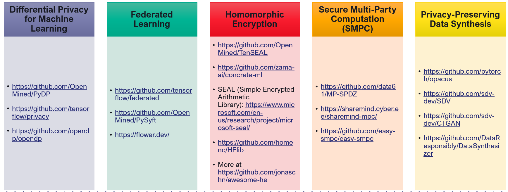

# Machine Learning Privacy-Preserving Techniques

## Differential Privacy for Machine Learning

Differential privacy is a technique that aims to protect the privacy of individual data points in a dataset by introducing noise or randomness during data aggregation or analysis. It provides a mathematical framework to quantify and control the privacy guarantees offered. When applied specifically to machine learning algorithms to the training process or the model's outputs, it helps protect individual data points and prevent inference of sensitive information from the trained models.

An example sequence of handling data:

__Data Provider → Data Preprocessing → Noise Generation → Aggregation/Query → Output Release → Data Users__

**Data Provider**
The data provider is the entity that possesses the sensitive data that needs to be protected. This can be an individual, organization, or any entity responsible for managing and providing access to the data.

**Data Preprocessing**
The data preprocessing stage involves cleaning, transforming, and anonymizing the data to remove personally identifiable information (PII) or any sensitive attributes that could potentially identify individuals. This step ensures that the data is properly prepared for privacy-preserving analysis. e.g., scikit-learn: Provides a wide range of preprocessing tools for feature scaling, encoding categorical variables, and handling missing data.

**Noise Generation**
Differential privacy relies on the addition of controlled noise to the data to protect individual privacy while still providing statistically accurate results. The noise generation component introduces randomness into the data, preserving privacy by making it difficult to distinguish the contribution of any specific individual. e.g., PyDP: A Python library that implements differential privacy mechanisms, including Laplace and Gaussian noise generation, for adding privacy guarantees to computations and analyses. https://github.com/OpenMined/PyDP

**Aggregation/Query**
The aggregated data or queries are processed using privacy-preserving algorithms or mechanisms that take into account the added noise. Aggregation involves combining data from multiple individuals or sources, while queries refer to specific operations or computations performed on the data, such as calculating averages, counts, or other statistical measures. e.g., TensorFlow Privacy: A library that extends TensorFlow, a popular deep learning framework, with differential privacy capabilities, enabling privacy-preserving training and evaluation of ML models. https://github.com/tensorflow/privacy

**Output Release**
The output release stage involves providing the final results of the analysis or computation to the data users or requesting entities. This output is carefully crafted to preserve privacy by ensuring that no individual's data can be re-identified or inferred from the released information. e.g., OpenDP: An open-source library that provides tools and mechanisms for releasing differentially private data or results while maintaining privacy guarantees. It supports various data analysis tasks, including aggregation, counting, and histograms. https://github.com/opendp/opendp

**Data Users**
Data users are the entities or individuals who utilize the output or results of the privacy-preserving analysis for decision-making, research, or other purposes. The data users can access the released results while having strong privacy guarantees that protect the individuals' sensitive information.

## Federated Learning

Federated learning enables model training on decentralized data while preserving data privacy. Instead of centralizing data on a single server, the model is trained locally on individual devices or servers, and only aggregated model updates are shared. This ensures that sensitive data remains on the local devices, reducing privacy risks. Let's take H5 model as example to understand this.

Some interesting libraries to try out:
- https://github.com/tensorflow/federated
- https://github.com/OpenMined/PySyft
- https://flower.dev/

## Homomorphic Encryption

Homomorphic encryption allows computations to be performed on encrypted data without decrypting it. This technique enables secure data processing while maintaining privacy, as data remains encrypted throughout the computation.

An example sequence of operation:

__Data Owner → Data Preprocessing → Homomorphic Encryption → Encrypted Data → Homomorphic Computation → Decrypted Result → Data User__

**Data Owner**
The data owner possesses the sensitive data that needs to be protected. This can be an individual, organization, or any entity responsible for managing and providing access to the data.

**Data Preprocessing**
The data preprocessing stage involves cleaning, transforming, and preparing the data for analysis. This step ensures that the data is properly formatted and ready for the subsequent privacy-preserving steps.

**Homomorphic Encryption**
Homomorphic encryption is applied to the data, allowing computations to be performed on the encrypted data without requiring decryption. This cryptographic technique ensures that the data remains secure and private during computation.
- https://github.com/OpenMined/TenSEAL
- https://github.com/zama-ai/concrete-ml
- SEAL (Simple Encrypted Arithmetic Library): https://www.microsoft.com/en-us/research/project/microsoft-seal/
- https://github.com/homenc/HElib
- More → https://github.com/jonaschn/awesome-he

**Encrypted Data**
The data is encrypted using homomorphic encryption algorithms, resulting in encrypted representations of the original data. The encrypted data can be securely transmitted or stored without revealing its contents.

**Homomorphic Computation**
The encrypted data undergoes computation using homomorphic operations. This involves performing mathematical operations on the encrypted data without decrypting it, allowing the computation to be carried out while preserving data privacy.

**Decrypted Result**
After the required computations are performed on the encrypted data, the result is decrypted to obtain the final output. The decryption process ensures that the computation result is obtained in its original form, while the privacy of the data is preserved throughout the computation.

**Data User**
The data user is the entity or individual who utilizes the decrypted result for analysis, decision-making, or other purposes. The data user can access the final output while maintaining the privacy of the underlying encrypted data.

## Secure Multi-Party Computation (SMPC)

SMPC enables multiple parties to jointly compute a function on their private inputs without revealing the inputs to each other. This technique allows for collaborative data analysis and processing while preserving individual data privacy.

A sample computation:

__Party A → Party B → Party C → SMPC protocols → Secure Computation → Result__

**Party A, Party B, Party C**
The system involves multiple parties, denoted as Party A, Party B, Party C, and so on. Each party holds private inputs or data that they want to keep confidential during computation.

**SMPC Protocols**
Secure Multi-Party Computation (SMPC) protocols are used to enable privacy-preserving computation. These protocols allow parties to collaboratively compute a function on their private inputs without revealing any sensitive information.

**Secure Computation**
The secure computation stage involves the execution of the SMPC protocols. Each party securely shares their private input and performs computations while preserving privacy. The protocols ensure that no party can learn the inputs of others and that the final result is obtained without exposing any individual party's private information.

**Result**
The result represents the output of the computation performed using the SMPC protocols. It is obtained without revealing any individual party's private input or intermediate computation details.

Some interesting libraries to try out:
- https://github.com/data61/MP-SPDZ
- https://sharemind.cyber.ee/sharemind-mpc/
- https://github.com/easy-smpc/easy-smpc

## Privacy-Preserving Data Synthesis

Privacy-preserving data synthesis techniques generate synthetic data that preserves statistical properties and privacy guarantees of the original dataset. It enables data sharing while protecting sensitive information.

A sample operation:

__Raw Data → Data Preprocessing → Privacy-Preserving Data Synthesis → Synthesized Data → Data Consumer__

**Raw Data**
The raw data represents the original sensitive or private data that needs to be protected. This can include personally identifiable information (PII) or other sensitive data that must remain confidential.

**Data Preprocessing**
The data preprocessing stage involves cleaning, transforming, and anonymizing the raw data to remove any personally identifiable information or sensitive attributes. This step ensures that the data is suitable for privacy-preserving techniques.

**Privacy-Preserving Data Synthesis**
The privacy-preserving data synthesis component is responsible for generating synthetic data that retains statistical properties and patterns of the original data while preserving privacy. Various techniques, such as differential privacy or generative models, can be applied to synthesize privacy-preserving data.

**Synthesized Data**
The synthesized data represents the generated synthetic dataset that closely resembles the statistical characteristics of the original data while protecting privacy. The synthesized data can be used for analysis, research, or sharing with third parties while minimizing the risk of reidentification.

**Data Consumer**
The data consumer represents the entity or individual who utilizes the synthesized data for analysis, modeling, or other purposes. The data consumer can access and work with the synthesized data while maintaining the privacy and confidentiality of the original sensitive information.

Some interesting libraries to try out:
- https://github.com/pytorch/opacus
- https://github.com/sdv-dev/SDV
- https://github.com/sdv-dev/CTGAN
- https://github.com/DataResponsibly/DataSynthesizer

*Disclaimer: Thales does not endorse the utilization of any specific tool or library. The reference to such tools or libraries is purely for illustrative and informational purposes, and their use should be exercised with discretion.*